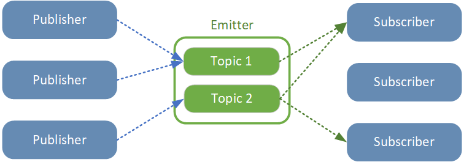

# Building a Ternary search tree

In computer science one of the key concept to boost your program performances is complexity.
Where there is complexity there's a loop, and where there's a loop there's a data structure.
Data structures are key components of every program, you (almost) can't do anything without it.
Now, this article is not about complexity or data structures comparison but about finding the right
one to a given problem, in my case performing wildcard search on strings. This will be illustrated
using the pub-sub pattern example. All code samples are in Typescript as I think the language is simple
enough to be understood by everybody and offers great functionnalities.

## Publishers and subscribers
I'm an avid user of the publish-subscribe pattern (not to be confused with the observer pattern).
For a quick recap, here's the concept.




As we can see in the upper schema we have a bunch of publishers which can *emit* (or publish) arbitrary data
on some *topics* on an *emitter*, and have some *subscribers* be notified whenever some new data is available
on *topics* they're subscribed to. This pattern allows for greater decoupling between publishers and subscribers
and is very well fit in an event-based program. A typical emitter usage could look like this:
```typescript
emitter.on('news', (data: string) => {
    console.log(data);
});

emitter.emit('news', 'great news!'); // Prints great news!
```
This pattern is very often used in servers dealing with websockets for example, when once a new socket is opened,
you register a subscriber on a global emitter to be notified when you have data to send back. 

## Emitting using wildcards
This pattern is great but suffers from one big limitation which is the fact that emitting cannot be broadcasted to multiple
subscribers. Consider the following example with three wizard players in an online game:

```typescript
for (const name of ['bob', 'marie', 'marcel']) {
    emitter.on(`wizard/${name}`, (data: string) => {
        console.log(`Wizard ${name} received the following message: ${data}`);
    });
}
```

Emitting to a single player is as easily done as emitting to `wizard/marcel` for example.
But now, what if I want to send a message to all wizards at the same time ? I'd have to loop through all wizards:

```typescript
for (const name of ['bob', 'marie', 'marcel']) {
    emitter.emit(`wizard/${name}`, "a message to all wizards");
}
```

Knowing the name of every wizard is also required, which implies retrieving it from a service,
thus increasing coupling between components. What if you could do something like

```typescript
emitter.emit("wizard/*", "a message to all wizards");
```

Using wildcards would offer much greater flexibility at using the emitter.

## The internals of an emitter
Generally speaking, an emitter is simply an object which keeps track of subscribers and triggers them
whenever something is made available for them to consume. A simple and naive implementation would look like this:

```typescript
class Emitter {

    // Map subscribers to the topic they're subscribed to
    // Here, the Subscriber type represents a Function
    private subscribers: Map<string, Set<Subscriber>> = new Map();

    // Called when a subscriber whishes to subscribe to a given topic
    on(topic: string, subscriber: Subscriber) {
        if (!this.subscribers.has(topic)) this.subscribers.set(topic, new Set());
        this.subscribers.get(topic).add(subscriber);
    }

    // Called when a publisher whishes to emit data on a given topic
    emit(topic: string, data: any) {
        if (!this.subscribers.has(topic)) return; // Return if no subscribers
        this.subscribers.get(topic).forEach((subscriber) => subscriber(data));
    }
}

```

This implementation is very minimal, no unsubscribe for example, but already offers a working solution.

### Storing subscribers
As you can see in the upper example, we use a **Map** of **Sets** to store our subscribers.
- The Map, or as it's implemented behind the curtains in typescript, a HashMap, is a data structure which is used to map a value
to another value and offers a theorical complexity of *O(1)* (*O(n)* in worst case) when accessing a value by its key.
- The Set data structure is used to store distinct values and also offers an expected complexity of *O(1)* (*O(n)* in worst case).
We're using it here because in nature, it doesn't allow a value to be repeated, which is the only reason **in this case** for it
to be prefered over an array. We're thus garanteed that each subscriber will only subscribe once to a given topic.

### Accessing subscribers
To access a set of subscribers, we simply have to `subscribers.get(topic)` and iterate over them. But what if the topic looks like
`wizard/*` ? We don't have a single topic registered there, only
```typescript
['wizard/bob', 'wizard/marie', 'wizard/marcel']
```
which will return nothing. To check for `wizard/*`, we'd have to loop through each key of the map (thus each registered topic), and
used some computing to check if it matches, going from an *O(1)* complexity to an *O(n)*, and even more as we have to iterate over each
caracter of each topic key, losing all performance once more players are connected.

## Introducing the ternary search tree
A ternary search tree is a data structure which can be used to store strings with support for incremental search. They are often used
in scenarios where we want to implement auto-completion or a simple spell checker. It offers a complexity of *O(log(n))* (*O(n)* worst case)
for searching, inserting or deleting values. That's a bit worse than the map's *O(1)* but way better than *O(n)*.