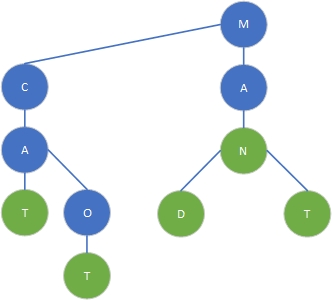
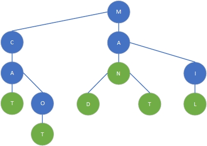
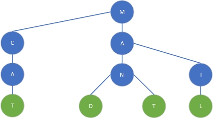

<ToggleFavorite />

# Building a Ternary search tree in Typescript

This blog post will illustrate a possible implementation of a ternary search tree in typescript.

## What's a ternary search tree
A ternary search tree is a special kind of prefix tree (also called *tries*) which is often
used to store strings and perform advanced search on them. This blog post will only cover the
three mandatory operations to use it, which are *insert*, *search* and *delete*.

### Complexity of operations
The ternary search tree offers the same time complexity for each operation, searching, inserting
and deleting a string of *O(log n)* in average and *O(n)* in worst case, depending of the
tree's internal structure.

It's thus worse, for example, than traditional Hashmaps *in general*, but offers other
significant advantages that we'll see later. We will first focus on the standard operations
listed upward.

### Internal structure
Let's first define our tree class.

```typescript
class TernarySearchTree<T> {

    /**
     * The root node of our tree
     */
    private root: Node<T> | null = null;

    /**
     * Counter of the number of nodes in the tree
     */
    private nodes: number = 0;

    /**
     * Counter of the number of values in the tree
     */
    private values: number = 0;

    get numberOfNodes() {
        return this.nodes;
    }

    get size() {
        return this.values;
    }
}
```
As we can see our tree keeps track of its root node as well as counting the total number
of nodes it holds and of values inserted.

::: tip Learn more
There's a lot of documentation online which will explain in more details what's awesome
about ternary search trees but it won't be seen in this post, maybe in later ones. Here
we'll focus on keeping it simple enough to understand how to implement one.
:::

#### Nodes
As every tree structure, a ternary search tree is made of nodes, but these nodes can
*only* have up to three children and can contain a specific value.

```typescript
class Node<T> {

    public left: Node<T> | null = null;

    public right: Node<T> | null = null;

    public mid: Node<T> | null = null;

    public value: T | null = null;

    /**
     * The key is a single character of the alphabet
     * Typescript strings allow for ">", "<" and "==" comparison directly
     */
    public readonly key: string;

    constructor(key: string, value: T | null = null) {
        this.value = value;
        this.key = key;
    }
}
```

Some other implementations include the *parent* node which could be useful for the *delete*
operation as we'll see later, but it can be done without it.

### How data is structured
Imagine a ternary search tree in which we insert, in order, *man, mad, mat, cat* and *cot*.
Here would be the visual result:

<div style="display:flex;flex-direction:column;align-items:center">
    
    <legend style="margin-top:1rem;color:grey;">Our tree after inserting man, mad, mat, cat and cot in this order</legend>
</div>

In blue are the nodes which contain no value, in green the nodes which containe a value. This value
is a simple boolean which is *true* if it marks the end of a word. Each of them can have 3 children:
- **left** which points to a node with a lower character as key
- **right** which points to a node with a higher character as key
- **middle** which points to the next node to consider, see the next example

## Searching for a key
Let's try to find **mad** in the upper tree as an example.
- Let's start with the first letter of our string, which is *M*
- We first start on the root node, which is *M*, as both characters are the same we can take the middle
node and go on to the next one. We move the cursor in our string to the next character, which is *A*.
- After taking the middle node, we arrive on a *A* node, which is the same as the second character from
our word, we can then take the middle node again and move the cursor in our string to the next, which is *D*.
- Now the next node has a key of *N* and our current character in string is *D*, which is lower than *N*, so
we take the left node
- We arrive on the *D* node, which is the same character as the current one of our cursor in *mad*. As we're at the
end of our string, we check if the value on the *D* node is *true*. It's a yes, boom we can say that *mad* is in
our ternary search tree.

### Searching algorithm
As seen in the upper example, we start at the root of our tree and take the characters in our string one after the other.
- If the character is lower than the current node's key, take its left child
- If it's higher, take its right child
- If it's the same, move on to the next character in the key and take the middle child, and if no other character 
in the key return the value associated with the current node

### Implementing the search algorithm
Searching for a string in our tree is not so complicated as we saw earlier, here is a possible implementation.
```typescript
/**
 * Finds the value associated with the given key if it exists in the tree
 * @return T | null
 */
get(key: string): T | null {
    // We directly transform the key to an array of
    // characters for easier manipulation
    return this.find(this.root, [...key]);
}

/**
 * Internally used to iterate recursively over nodes
 * @param node The node we're currently checking
 * @param key the remaining of the key
 * @param callback executed when we move to another node
 */
private find(node: Node<T> | null, key: string[], callback: ((n: Node<T>) => void) | null): T | null {
    if (node === null) return null; // No node, no value

    // The callback will be used in the delete operation
    // We'll see it later
    if (callback) {
        callback(node);
    }

    // Take the first character of the key and the remaining of it
    const [c, ...rest] = key;

    // lower char, go to left
    if (c < node.key) return this.find(node.left, key, callback);

    // higher char, go to right
    if (c > node.key) return this.find(node.right, key, callback);

    // if we still have some characters in our key, go to mid
    if (rest.length > 0) return this.find(node.mid, rest, callback);

    // Otherwise we reached the node we wanted, return value if any
    return node.value;
}
```

## Inserting a value
Inserting a value follows the same rules as searching for a string. For example,
let's try to insert **mil** in our tree.
- We take the first character in our string, which is *M*.
- We start at the root of our tree. Its key is also *M*, let's move on to the middle node
and take the next character in our string, which is *I*
- The next node's key is *A*, which is lower than *I*, we thus take the right node
- Trying to move to the right we see that no node exist! We thus create an *I* node as the
*A* node's right child and move on to it.
- Surprisingly, the *I* node's key match with our current character, which is *I*! we take
the next character in our string which is *L* and take the middle node.
- As expected, nothing is in the middle node, so we create one, assign it the *L* key and move
on to it.
- As we have no more characters in our string we reached the ending node, so we can set its
value to *true*.

<div style="display:flex;flex-direction:column;align-items:center">
    
    <legend style="margin-top:1rem;color:grey;">After inserting mil</legend>
</div>

### Implementing the insertion algorithm
Here is a recursive implementation of the insertion algorithm.
```typescript
/**
 * Inserts the given value at the given key
 * @param key the key where to insert
 * @param value the value to insert
 */
set(key: string, value: T) {
    this.root = this.insert(this.root, [...key], value);
}

/**
 * Internally used to iterate over nodes or create them if necessary
 * in order to insert the value
 */
private insert(node: Node<T> | null, key: string[], value: T): Node<T> {
    const [c, ...rest] = key;

    if (node === null) {
        node = new Node(c);
        this.nodes += 1;
    }

    // Note that we recursively set the node's child value in order to
    // maintain the relationship between each other. This way, if the
    // node we need to go to is null, it will be created in the next
    // call of *insert* and set here
    if (c < node.key) node.left = this.insert(node.left, key, value);
    else if (c > node.key) node.right = this.insert(node.right, key, value);
    else if (rest.length > 0) node.mid = this.insert(node.mid, rest, value);
    else {
        node.value = value;
        this.values += 1;
    }
    return node;
}
```

## Deleting a value
Removing a value from a ternary search tree is a little bit more complex, as
there's more cases to take care of.
1. The key is not in the tree, we do nothing
2. The key is part of a longer string (for example if there was *mate* in our tree and we
try to remove *mat*, we don't want to remove *mate* with it)
3. The last node matching the last character of the key is a leaf, start removing
nodes from here until we find another node that has other children or a value

There exist multiple different algorithms on internet, but in the end
what's important is going back up from the node we remove until we can't remove anymore,
to avoid having useless nodes and branches.

For example, deleting **cot** from our tree:
- We have found the last *T* node, we remove its value (set it to false here)
- The *T* node has no children, we can move back to the *O* node and remove its middle
node (our *T* node)
- The *O* node has no value and no children, we can go back to the *A* node and
remove its right child (the *O* node)
- The *A* node has a middle child, we can't keep on removing, we stop here.

Now if we wanted to remove **man** too:
- We arrived at the *N* node, we set its value to false
- The *N* node has children, we can't remove it, we stop here

<div style="display:flex;flex-direction:column;align-items:center">
    
    <legend style="margin-top:1rem;color:grey;">After having removed cot and man</legend>
</div>

### Implementing the deletion algorithm
Here is a possible implementation of the deletion algorithm. We start by trying to find
if the key exists in the tree (which means if a value can be found), and we use the 
`callback` of the `find` method to build the path of nodes we needed to traverse in
order to find this value.
```typescript
remove(key: string) {
    return this.delete([...key]);
}

private delete(key: string[]) {

    const path: Node<T>[] = [];
    const value = this.find(this.root, key, (n) => {
        path.push(n)
    });

    // Reverse path to start from the last node
    path.reverse();

    // Extract current node, the one with the value to remove
    let node = path.shift();

    if (value === null || !node) {
        return; // No value found, nothing to remove
    } else {
        node.value = null; // otherwise remove value
        this.values -= 1;
    }

    // Proceed with deletion until we can't
    while (node) {

        // Current node has a value, stop
        if (node.value) return;

        // if current node has no children 
        else if (node.mid === null && node.left === null && node.right === null) {

            // Get parent from current node
            const parent = path.shift();

            // We have no parent, which means current node is root
            if (!parent) {
                this.root = null;
                return;
            }
            else if (parent.left === node) parent.left = null;
            else if (parent.right === node) parent.right = null;
            else if (parent.mid === node) parent.mid = null;
            this.nodes -= 1;

            // move on to the parent and restart loop
            node = parent;
        }

        // if there's a child, stop
        else return;
    }
}
```

## Trying our ternary search tree
Before testing our implementation, let me provide you a small `print`
function which displays the content of the tree.
```typescript
print(node: Node<T> | null = this.root, prefix: string = '') {
    if (node === null) return '';

    const prefix1 = `${prefix}  `;
    const prefix2 = `${prefix1}  `;
    let result = '';
    result += `${prefix}${node.key}${node.value ? `(${node.value})` : ''}\n`;
    if (node.left) result += `${prefix1}Left:\n${this.print(node.left, prefix2)}`;
    if (node.mid) result += `${prefix1}Middle:\n${this.print(node.mid, prefix2)}`;
    if (node.right) result += `${prefix1}Right:\n${this.print(node.right, prefix2)}`;
    return result;
}
```

Let's try our implementation by reproducing the example of this post.
```typescript
const tree = new TernarySearchTree();
tree.set('man', 1);
tree.set('mad', 2);
tree.set('mat', 3);
tree.set('cat', 4);
tree.set('cot', 5);

console.log(tree.get('mat')); // 3
console.log(tree.get('cot')); // 5

console.log(tree.print());

tree.remove('cot');
tree.remove('man');

console.log(tree.get('mat')); // 3

console.log(tree.print());
```

## Conclusion
In this post we saw a simple implementation of a ternary search tree in Typescript.
I hope this helped you understand how this data structure works and how you
can use it in your code!